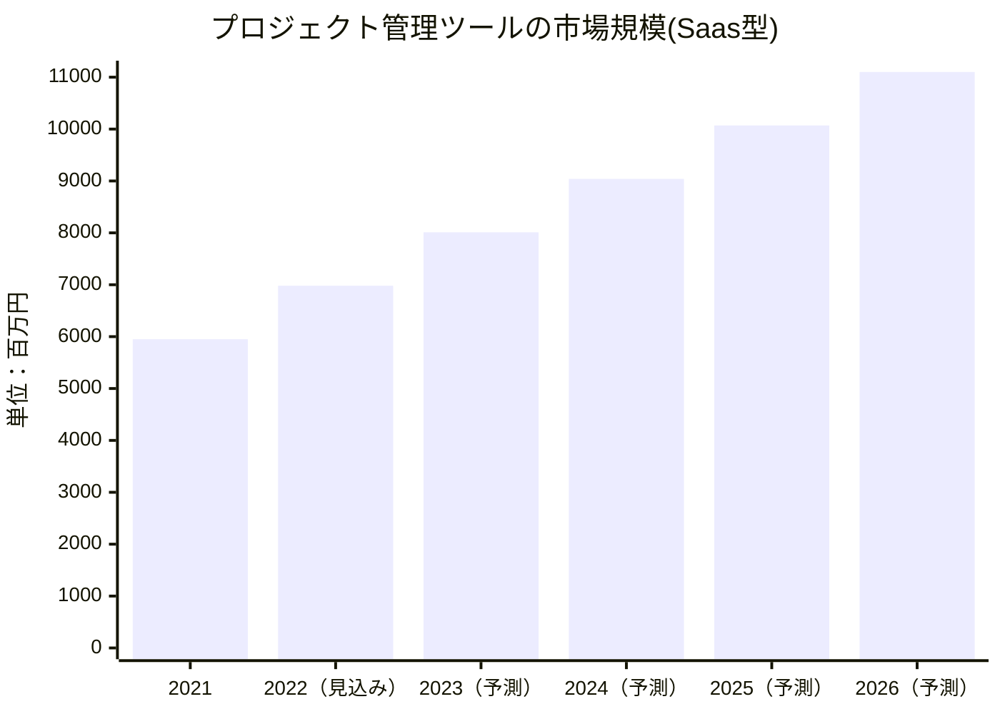

# 律してくれるサービス「リッスル」

## きっかけ
人々は日々のタスクに追われ、今日自分がなにをすればいいかで頭がいっぱいになっている。  
人々をもっと上位の存在が律してくれれば、そうすればもっと人々は豊かな時間をすごすことができる。  

## 概要

「リッスル」では、やらないといけないことをまとめ、時間が来れば通知してくれる。  
工数管理をすることができ、ガントチャートやイベントカレンダーを作成してくれる。  
タスクが多すぎる場合は助けてくれるサービス（確定申告をしてくれる税理士や、家事をしてくれるヘルパーなど）を案内してくれる。  
余裕がある場合は趣味やレジャー（近くの娯楽施設など）を案内してくれる。

「リッスル」君はリスのキャラクターで、やらないといけないことをかわいくおしえてくれるキャラクター。キャラクターグッズもマネタイズできる。

## キャッチコピー
「リッスルに書いて忘れて頭すっきり！」  
「いつも私はタスクに集中！必要な時になったらリッスルが呼んでくれる！」  
「子供が学校で必要なもの、いつでもリストアップ！」

## マネタイズ
重いデータを取り扱わないサービスなので運用コストが安く、無料である程度充実したサービスを提供してもあまり負担にはならない。  
グッズ販売も展開する。  
また、セキュリティを確保したプライバシーマーク取得版の有料版である「リッスルワークス」を提供すれば企業にも使ってもらえる。そのためにも、「リッスル」を無料サービスにしてまずはいろんな人に使って試してもらうところから始める必要がある。

概要欄で示したような他サービスへの広告欄もマネタイズ化できる。

## 市場規模

富士キメラ総研の調査結果によると、プロジェクト管理ツールは年々市場規模が拡大している。  
コスト削減・業務効率化が意識され、労働人口の減少や働き方改革なども勢いを後押しし、また業務のデジタル化も進む中でプロジェクト管理ツールは欠かせないものになってきている。

出典：富士キメラ総研「ソフトウェアビジネス新市場 2022年版」

## 機能

基本機能はシンプルに以下をコアとする

* ガントチャートの作成
* タスク一覧の作成
* タスクカレンダーの作成
* 自分のタスクのリマインド通知機能
* 他人のタスク管理（進捗管理など）

副次的なサービスとして以下を用意する

* タスクを代行してくれるサービスの紹介
* 余暇施設の紹介
* キャラクターグッズの販売

## 類似サービス・競合サービス

### Lychee Redmine

ご存知Redmineのオンラインサービス。

#### メリット・デメリット

* 有料プランは高すぎる
* フリープランだとほしい機能が全然無い
* 機能が大げさすぎる

### habitica

日々の作業をゲーム化して、楽しく日々の作業を進めてゆけるサービス

#### メリット・デメリット

* 操作がややこしく、日々使うのには向かない